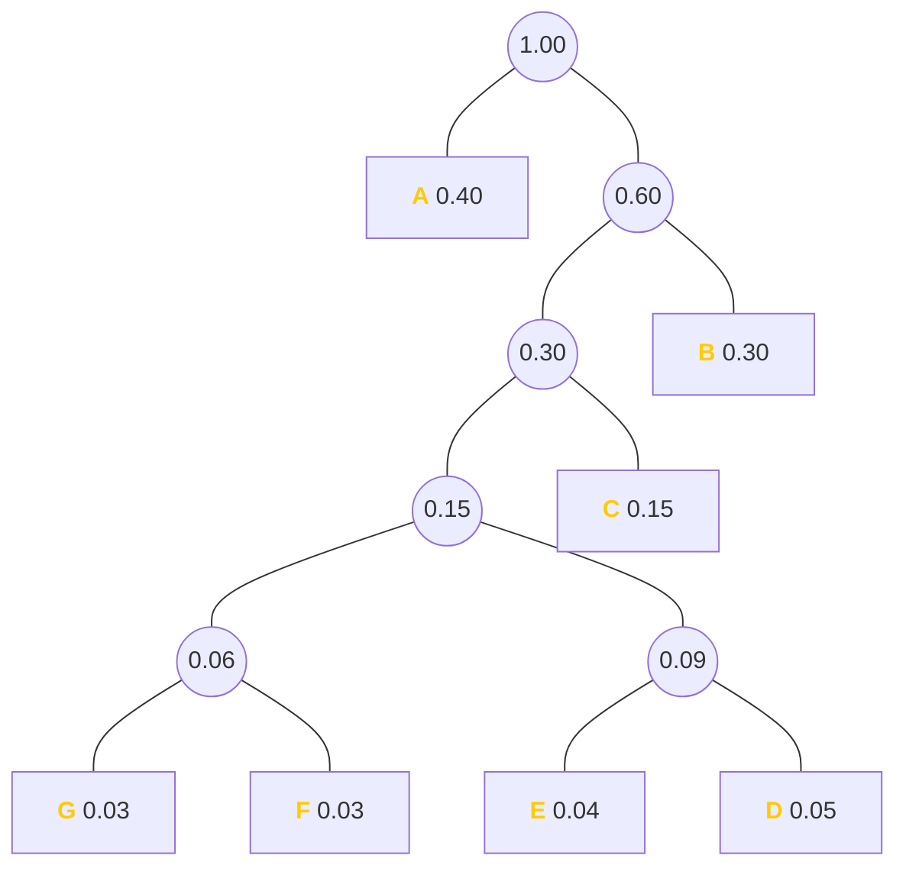
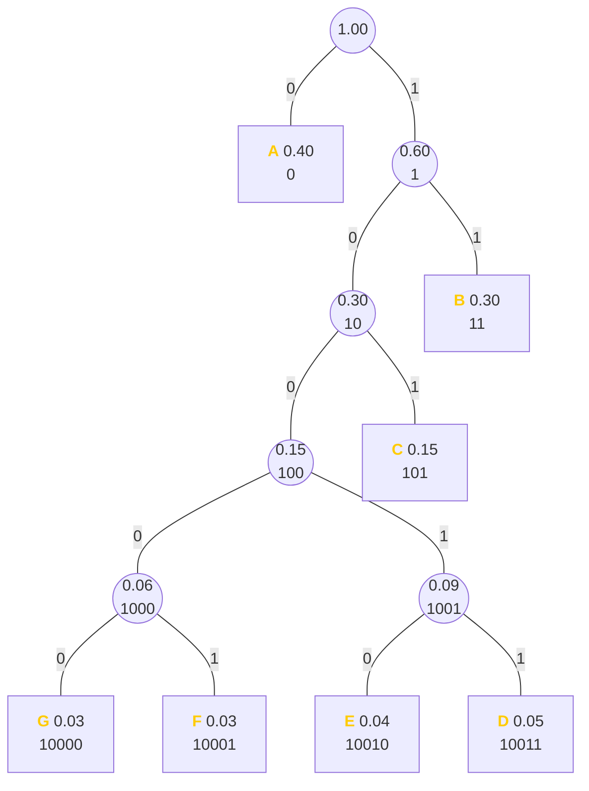

# Categories
- <span id="huffman">哈夫曼编码</span>
    - [2024-07-04 \[10\]](#10)
- <span id="gaojing">高精度</span>
    - [2024-07-04 \[12\]](#12)
- <span id="pailie">排列组合</span>
    - [2024-07-04 \[15\]](#15)
    - [2024-07-16 选择-\[8\]](#选择-8)
- <span id="sort">排序</span>
    - [2024-07-04 \[16\]](#16)
- <span id="calc">计算</span>
    - [2024-07-16 选择-\[2\]](#选择-2)
- <span id="firstinf">基础知识</span>
    - [2024-07-16 选择-\[3\]](#选择-3)
- <span id="bintree">二叉树</span>
    - [2024-07-16 选择-\[5\]](#选择-5)


# 2024-07-04


## \[10\]

如图（哈夫曼树）所示，假设 B 的编码为 `11`，则 D 的编码为？



[click here if mermaid doesn't show](https://mermaid.ink/svg/pako:eNqFkt9rgzAQx_-VkEGxUN2JVVC6QlvbPu1pe1tKyTT-ADUjRkYp_d-XxM7ZvZin3OW-n-9duCtOeMpwhLOKfycFFRK9x6RB6riW5ToA8zmybRttPlatFLzJUSsvFXshSlhxET1lWfIJQPB6s3ruK9YInCWc0AzBObAscAIF6ZkqYWhw9vSDp-kztJ1kb8dsD06_NO9Oc32Nc32D203idmOc6w8417_zwPQNgeGpMDRh-DcG9HMcJ62OYyvw9K8cJkWHf6LBNTSu-0nA_gGw1K7xpCh-EPknvMA1EzUtU7UfV90DwbJgNSM4UteUZbSrJMGkualS2kn-dmkSHEnRsQUWvMsLHGW0alXUfaVUsrikuaD1kGVpKbl47TfQLOLtBxmRwj0)

------


[click here if mermaid doesn't show](https://mermaid.ink/svg/pako:eNqFkt1ugjAYhm-l6U4gUfY1qAmEmaioF7CdrcRUKGjCz1JKFqPe-ypQQbIEjoC-PM_7tVxxWEQcuzhOi9_wxIREXz7NkbqIYRALwDTRdDq9wQ2tvr1SiiJPUCkvKf-g6tu0EO5bHIdHAIqXK--9SSwRWDPwjmIJQUurKeSG4LAwDLAW9SoxzWZZvdUaONiPgN0EYJhQiPVokXW_SEsigQbZnYrMHy4yb1w9ma1lm1HZpi_TqM5G5p0O6tlh0ep6vjZVbxA4dcppU71Ngucu7Udr7fu1wNZKCAYwpdyNwnb_w7opwdHNtqOw7QtspseEIUw180dh_gtMH6Q6bTzBGRcZO0fq974-0BTLE884xa66jXjMqlRSTPO7irJKFp-XPMSuFBWfYFFUyQm7MUtL9VT9RExy_8wSwbImcv8DjKnvGQ)

哈夫曼树的左子树为 0，右子树为 1。将它们连起来即可得到 **`10011`**。

*Category:* *[哈夫曼编码](#huffman)*


## \[12\]

关于高精度运算说法错误的是？

<ol type="A" style="list-style-type:upper-alpha;">
    <li>高精度计算主要是用来处理大整数或需要保留多位小数的运算</li>
    <li>大整数除以小整数的步骤：将被除数和除数对齐，从左到右逐位尝试将除数乘以某个数，通过减法得到被除数，并累加商</li>
    <li>高精度乘法的运算时间只与两个运算数中长度较长者有关</li>
    <li>高精度加法运算关键在于逐位相加并处理进位</li>
</ol>

------

**C**  
乘法时将两个乘数分别放 A 数组 和 B 数组，答案放 C 数组。计算 A 数组的第 i 位和 B 数组 的第 j 位相乘的答案为：`C[i + j - 1] += A[i] + B[j];`。  
高精度乘法的运算时间和两个乘数长度都相关。

> 高精乘法代码如下：
> ```cpp
> void mul(int a[], int b[], int c[]) {
>     clear(c);
>
>     for(int i = 0; i < LEN - 1; ++i) {
>         for(int j = 0; j <= i; ++j) {c[i] += a[j] * b[i - j];}
>         if(c[i] >= 10) {
>             c[i + 1] += c[i] / 10;
>             c[i] %= 10;
>         }
>     }
> }
> ```
> [oi-wiki](https://oi-wiki.org/math/bignum/#%E4%B9%98%E6%B3%95)

*Category:* *[高精度](#gaojing)*


## \[15\]

小明一天中依次有 7 个空闲的时间段，他想选出**至少** **1** **个空闲时间段**来练习唱歌，任意两个时间段之间都至少有 2 个空闲的时间段让他休息。一共有几种选择时间段的方案？

------

**18**  
可以枚举。  
选择 n 个练习时间段，有：  
1, 7;  
2, 10;  
3, 1.

*Category:* *[排列组合](#pailie)*


## \[16\]

在 $n$ 个数中找到最大数，需要比较多少次？

------

$\mathbf{n - 1}$  
就像冒泡排序的**第一次比较**：

$$
\begin{aligned}
&\mathtt{8 \ 5 \ 7 \ 9 \ 2 \ 6} \ \\ \\
&\mathtt{{\color{red}5} \ {\color{red}8} \ 7 \ 9 \ 2 \ 6} \ \\
&\mathtt{5 \ {\color{red}7} \ {\color{red}8} \ 9 \ 2 \ 6} \ \\
&\mathtt{5 \ 7 \ {\color{red}8} \ {\color{red}9} \ 2 \ 6} \ \\
&\mathtt{5 \ 7 \ 8 \ {\color{red}2} \ {\color{red}9} \ 6} \ \\
&\mathtt{5 \ 7 \ 8 \ 2 \ {\color{red}6} \ {\color{red}9}} \ \\
&\mathtt{5 \ 7 \ 8 \ 2 \ 6 \ {\color{green}9}} \ \\
\end{aligned}
$$

[click here if math doesn't render](https://joywonderful.github.io/posts/sort/#%E4%BE%8B%E5%AD%90-1)

五行有红色的数字就是在进行比较。可见经过 $\mathbf{5}$ 次比较后就确定了 $\mathtt{9}$ 是这 $6$ 个数字中的最大数。可见找出最大数只需要 $n - 1$ 次。

*Category:* *[排序](#sort)*


# 2024-07-16


## 选择-\[2\]

现有一张 $24$ 寸的图片，分辨率是 $1920 \times 1080$，是 $32$ 位图像，达到 $25\%$ 的压缩率，占用的储存空间大小至少是？

<ol type="A" style="list-style-type:upper-alpha;">
    <li>512 KiB</li>
    <li>1 MiB</li>
    <li>2 MiB</li>
    <li>16 MiB</li>
</ol>

------

**C**

$$
\begin{aligned}
&1920\text{Byte} \times 1080\text{Byte} \times 32\text{bit} \times 0.25 \\
= \ &1920\text{Byte} \times 1080\text{Byte} \times 8\text{bit} \\
= \ &1920\text{Byte} \times 1080\text{Byte} \times 1\text{Byte} \\
= \ &2025\text{KiB} \\
\approx &1.97\text{MiB} \\
\approx &2\text{MiB}
\end{aligned}
$$

*Category:* *[计算](#calc)*


## 选择-\[3\]

链接器的功能是？

------

**把机器指令组合成完整的可执行程序**

*Category:* *[基础知识](#firstinf)*


## 选择-\[5\]

根节点的高度为 $1$ ，一棵高度为 $8$ 的完全三叉树最少的结点数是？

------

$\mathbf{1094}$

设高度为 $n$
从 $3^0$ 开始加，一直加到 $3^6$（$n - 1$ 个加数），再加上 $1$，也就是高度为 $n - 1$ 完美（满）三叉树的结点数加一。

就是 $1 + 3 + 9 + 27 + 81 + 243 + 729 + 1 = 1094$。

*Category:* *[二叉树](#bintree)*


## 选择-\[8\]

有 $5$ 个从 1 到 5 标号的小球和 $5$ 个同样标号的盒子，现将小球随机放入盒子，每个盒子仅放 $1$ 个小球，问每个盒子中的小球都与盒子标号不同的组合数是？

------

$\mathbf{44}$

1 号盒子只能放 2, 3, 4, 5 号球，2 号盒子只能放 1, 3, 4, 5 号球，以此类推。  
当 1 号盒子放 2 号球时，后 $4$ 个盒子有 $11$ 中情况。

$4 \times 11 = 44$。

*Category:* *[排列组合](#pailie)*


## 选择-\[12\]

以下排序算法中最好情况下时间复杂度与最坏情况下时间复杂度不相同的是？

<ol type="A" style="list-style-type:upper-alpha;">
    <li>简单选择排序</li>
    <li>简单冒泡排序</li>
    <li>归并排序算法</li>
    <li>简单插入排序</li>
</ol>

------

**D**

A, B, C 时间复杂度都是稳定的，只有插入排序最好时间复杂度为 $O(n)$，最坏为 $O(n^2)$。（$n$ 为元素个数）


## 阅读-\[1\]-选-\(6\)

```cpp
#include <iostream> 
#include <string>
#include <vector>
using namespace std;

string s;
vector <int> cnt(26);

int main() {
    cin >> s;
    for (int i = 0; i < s.length(); ++i) {
        if (cnt[s[i] - 'a'] <= 50) {
            s += s[i];
        }
        ++cnt[s[i] - 'a'];
    }
    cout << s << endl;
    return 0;
}
```

设字符串 w 为 `abcd...z`，即从 a 到 z 在 w 中依次出现一次，共 26 个字符。若输入为 w 重复出现两次的结果 （即 `abcdefg...zabcdefg...z`，则输出结果为？

------

**w 重复出现 53 次的结果**

程序会将输入的任意字符串在字符数组内重复追加 51 次。加上原本输入的 2 次，就是 53 次。


## 阅读-\[2\]-选-\(6\)

```cpp
#include<iostream>
// #include<algorithm>

using namespace std;
const int MAXN = 20;
int    h[MAXN][MAXN];
int f(int n, int m) {
    if(n <= 1 || m < 2)     
        return 1;
    if(h[n][m] != -1)
        return h[n][m];
    int ans = 0;
    for(int i=0; i < m; i+=2)
        ans += f(n-1,i);
    h[n][m] = ans;
    return ans;
}
int main( ) {
    int n, m;
    cin >> n >> m;
    for(int i = 0; i < MAXN; i++)
        for(int j = 0; j < MAXN; j++)
        h[i][j] = -1;
    // memset(h,255,sizeof(h));
    cout << f(n, m);
    return 0;
}
```

最坏情况下，此程序的时间复杂度是？

------

$O(m^2 n)$


## 阅读-\[3\]-选-\(6\)

```cpp
#include <iostream>

int solve1(int n) {
    int ret = 1;
    for(int i=1; i<=n; i++) {
        ret *= i;
        if(ret >= n)
            return ret;
    }
}

int solve2(int n) {
    int ret = 0;
    for(int i=1; i<=n; i++) {
        ret += i;
        if(ret >= n)
            return ret;
    }
}

int main() {
    int n;
    std::cin >> n;
    std::cout << solve1(solve2(n)) << " " << solve2(solve1(n)) << std::endl;
    return 0;
}
```

当输入的数大于等于 6 时, 第一项减去第二项的差值一定？

------

**小于等于 0 或大于等于 0**

当输入 `6`，输出 `6 6`；输入 `10`，输出 `24 28`；输入 `24` 输出 `120 28`。  
因此都有可能。