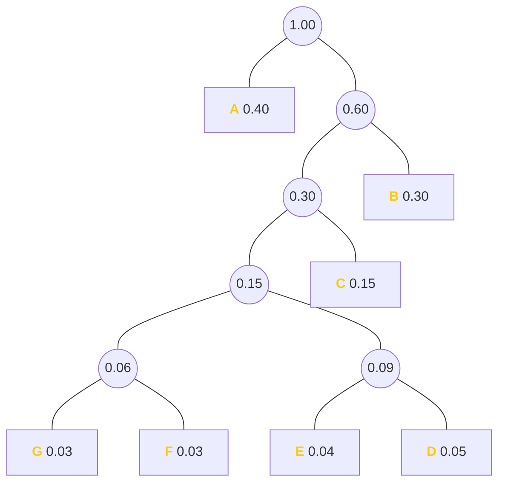

# 2024-07-04


## \[10\]

如图（哈夫曼树）所示，假设 B 的编码为 `11`，则 D 的编码为？



[click here if mermaid doesn't show](https://mermaid.ink/svg/pako:eNqFkt9rgzAQx_-VkEGxUN2JVVC6QlvbPu1pe1tKyTT-ADUjRkYp_d-XxM7ZvZin3OW-n-9duCtOeMpwhLOKfycFFRK9x6RB6riW5ToA8zmybRttPlatFLzJUSsvFXshSlhxET1lWfIJQPB6s3ruK9YInCWc0AzBObAscAIF6ZkqYWhw9vSDp-kztJ1kb8dsD06_NO9Oc32Nc32D203idmOc6w8417_zwPQNgeGpMDRh-DcG9HMcJ62OYyvw9K8cJkWHf6LBNTSu-0nA_gGw1K7xpCh-EPknvMA1EzUtU7UfV90DwbJgNSM4UteUZbSrJMGkualS2kn-dmkSHEnRsQUWvMsLHGW0alXUfaVUsrikuaD1kGVpKbl47TfQLOLtBxmRwj0)

------

哈夫曼树的左子树为 0，右子树为 1。将它们连起来即可得到 **`10011`**。


## \[12\]

关于高精度运算说法错误的是？

<ol style="list-style-type:upper-alpha;">
    <li>高精度计算主要是用来处理大整数或需要保留多位小数的运算</li>
    <li>大整数除以小整数的步骤：将被除数和除数对齐，从左到右逐位尝试将除数乘以某个数，通过减法得到被除数，并累加商</li>
    <li>高精度乘法的运算时间只与两个运算数中长度较长者有关</li>
    <li>高精度加法运算关键在于逐位相加并处理进位</li>
</ol>

------

**C**  
乘法时将两个乘数分别放 A 数组 和 B 数组，答案放 C 数组。计算 A 数组的第 i 位和 B 数组 的第 j 位相乘的答案为：`C[i + j - 1] += A[i] + B[j];`。  
高精度乘法的运算时间和两个乘数长度都相关。

> 高精乘法代码如下：
> ```cpp
> void mul(int a[], int b[], int c[]) {
>     clear(c);
>
>     for(int i = 0; i < LEN - 1; ++i) {
>         for(int j = 0; j <= i; ++j) {c[i] += a[j] * b[i - j];}
>         if(c[i] >= 10) {
>             c[i + 1] += c[i] / 10;
>             c[i] %= 10;
>         }
>     }
> }
> ```
> [oi-wiki](https://oi-wiki.org/math/bignum/#%E4%B9%98%E6%B3%95)


## \[15\]

小明一天中依次有 7 个空闲的时间段，他想选出**至少** **1** **个空闲时间段**来练习唱歌，任意两个时间段之间都至少有 2 个空闲的时间段让他休息。一共有几种选择时间段的方案？

------

**18**  
可以枚举。  
选择 n 个练习时间段，有：  
1, 7;  
2, 10;  
3, 1.


## \[16\]

在 $n$ 个数中找到最大数，需要比较多少次？

------

$\mathbf{n - 1}$  
就像冒泡排序的**第一次比较**：

$$
\mathtt{8 \ 5 \ 7 \ 9 \ 2 \ 6} \ \\ \\
\mathtt{{\color{red}5} \ {\color{red}8} \ 7 \ 9 \ 2 \ 6} \ \\
\mathtt{5 \ {\color{red}7} \ {\color{red}8} \ 9 \ 2 \ 6} \ \\
\mathtt{5 \ 7 \ {\color{red}8} \ {\color{red}9} \ 2 \ 6} \ \\
\mathtt{5 \ 7 \ 8 \ {\color{red}2} \ {\color{red}9} \ 6} \ \\
\mathtt{5 \ 7 \ 8 \ 2 \ {\color{red}6} \ {\color{red}9}} \ \\
\mathtt{5 \ 7 \ 8 \ 2 \ 6 \ {\color{green}9}} \ \\
$$

[click here if math doesn't render](https://joywonderful.github.io/posts/sort/#%E4%BE%8B%E5%AD%90-1)

五行有红色的数字就是在进行比较。可见经过 $\mathbf{5}$ 次比较后就确定了 $\mathtt{9}$ 是这 $6$ 个数字中的最大数。可见找出最大数只需要 $n - 1$ 次。